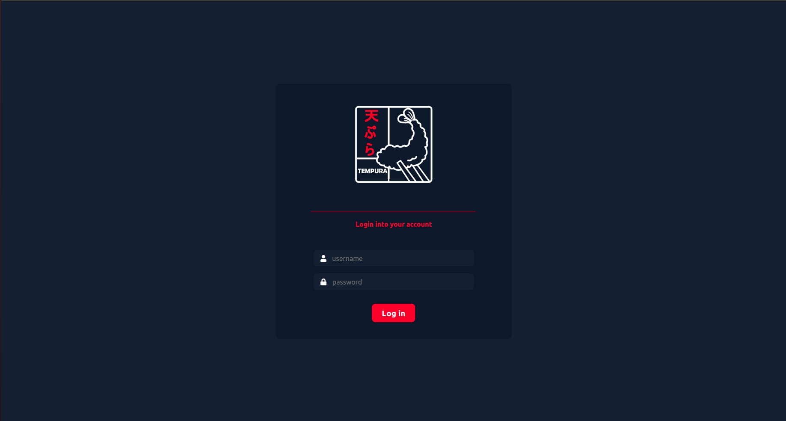
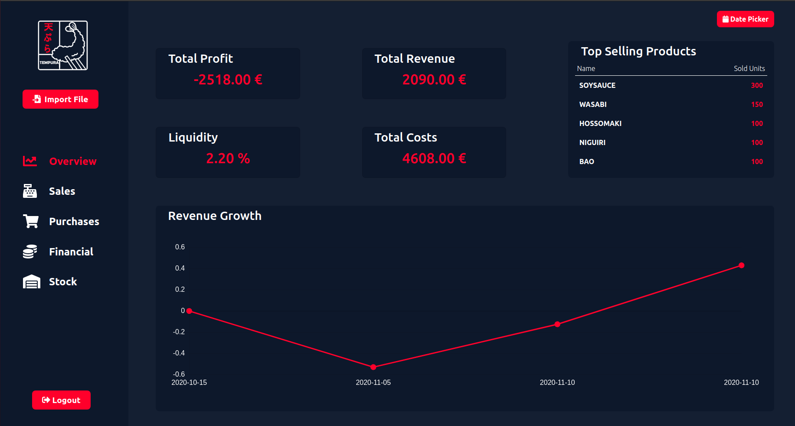
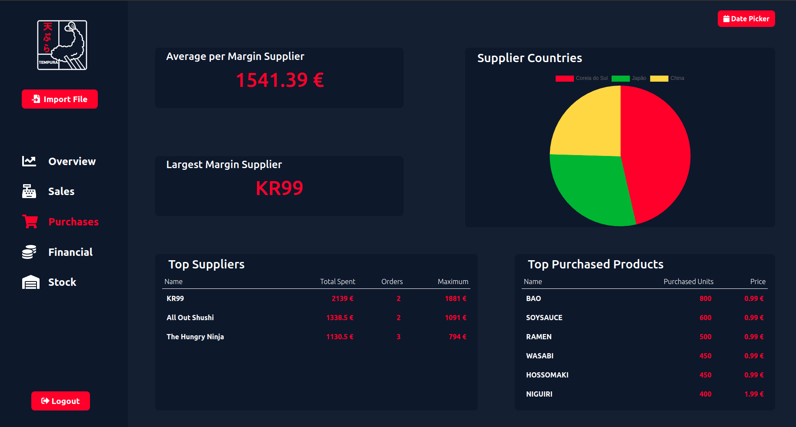

# Tempura
This is a web application that is able to present information and key performance indicators (KPIs), relevant to any business, in a more comprehensive and straightforward manner. It interoperates with the Primavera ERP and is meant for the company’s internal use.

This project was developed for the course SINF at FEUP.

## Info
 - **Date** : 4th year, 1st Semester, 2020/2021
 - **Course** : [Sistemas de Informação](https://sigarra.up.pt/feup/pt/ucurr_geral.ficha_uc_view?pv_ocorrencia_id=459494) | [Information Systems](https://sigarra.up.pt/feup/en/UCURR_GERAL.FICHA_UC_VIEW?pv_ocorrencia_id=459494)
 - **Colaborators** : [António Dantas](https://github.com/antoniopedrodantas), [Bernardo Santos](https://github.com/bernas670), [Filipe Ferreira](https://github.com/topogibra), [Leonor Freitas](https://github.com/leonormfreitas), [Vítor Gonçalves](https://github.com/vitorhugo13)

## A little preview

Login page

Overview page

Purchases page

## Running the project
Run each set of instructions below in different terminals in order to have the client and the server running at the same time. 
### Client
In the client directory, `/tempura/client`, run:
 - `yarn install`, to install all dependencies
 - `yarn start`, to run the client
### Server
In the server directory, `/tempura/server`, run:
 - `yarn install`, to install all dependencies
 - `yarn run setup`, to create the needed folder structure and files
 - `yarn start:watch`, to run the server

In case you want to populate the database you need to: 
 - run the commands above
 - let the server create the database tables
 - stop its execution
 - run `yarn run migration:run`
 - run `yarn start:watch`

## Resources
 - [Create Gantt Chart in Google Sheets](https://www.howtogeek.com/447783/how-to-create-a-gantt-chart-in-google-sheets/)
